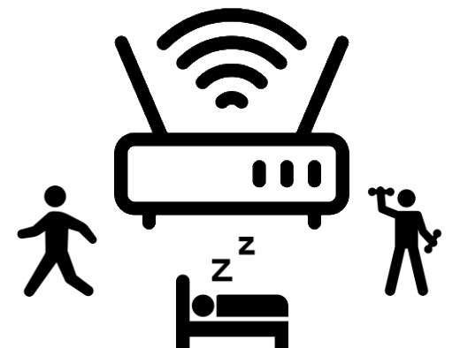

# Wi-Fi CSI Data Collection Software

<p align="center">

</p>

This application provides a streamlined user interface for orchestrating wireless Channel State Information (CSI) data collection experiments in the Wireless and Internet Research Laboratory (WIRLab) at the University of Toronto. It combines synchronized experiment timing, video previews, webcam capture, voice guidance, and automated logging so that researchers can reproduce gesture and activity datasets with minimal setup.

## Key features

- **Profile-driven workflow** – create reusable participant, experiment, action, and voice profiles so that every run is consistent and well documented.
- **Guided experiment timeline** – configure baseline, stop, and action windows with repetition counts, and let the app advance through each phase with clear prompts.
- **Action preview dialog** – review every activity with instructional text, countdowns, webcam preview, and a centered Wi-Fi sensing illustration before the actual recording starts.
- **Voice assistant powered by gTTS** – enable optional spoken prompts in multiple languages without relying on platform-specific voices.
- **Webcam recording support** – embed synchronized webcam footage in the UI, capture microphone audio, and save everything alongside CSI traces for later reference.
- **Hand recognition overlay** – optionally visualize MediaPipe-detected left/right hand joints on top of the webcam feed and export their timestamped landmark coordinates `(x, y, z, visibility)` along with time-series plots for downstream analysis.
- **Automated logging** – keep per-session text logs and organize collected datasets using the configured save location.
- **Fail-safe beeps and transcripts** – audible cues and on-screen transcripts ensure that participants know exactly when to move.

## Requirements

- Python 3.9+
- PyQt5, NumPy, Matplotlib, OpenCV (optional for webcam), SoX (`play`) for beeps
- `sounddevice` (optional) when microphone audio should be recorded together with the webcam
- `gtts` Python package for synthesized voice guidance
- `mediapipe` (optional) to enable hand recognition overlays and landmark recording

Install dependencies in a virtual environment:

```bash
python -m venv .venv
source .venv/bin/activate
pip install -r requirements.txt  # or install PyQt5, numpy, matplotlib, opencv-python, gtts
```

## Running the software

```bash
python main.py
```

1. **Create or load profiles** using the configuration dialog (participants, experiments, actions, and voices). Profile CSV files live in the `configs/` folder beside the codebase, and each tab ships with a read-only default profile—duplicate it to tailor settings.
2. **Preview actions** to walk participants through each movement. The Wi-Fi sensing image appears in the center of the window while instructions are read aloud (if enabled).
3. **Start the experiment** to begin collecting CSI data. The main window shows elapsed time, remaining repetitions, preview videos, transcript overlays, and optional webcam feed.

## Voice assistant configuration

The voice assistant now exclusively belongs to the voice profile. Toggle “Enable spoken instructions” in the **Voice** tab and choose a preferred language (English, German, Spanish, French, Italian, Portuguese, Hindi, Japanese, Korean, Russian, Arabic, Persian, or Chinese). The application synthesizes prompts with [gTTS](https://pypi.org/project/gTTS/) and plays them through Qt’s media player. If gTTS or audio playback is unavailable, the option automatically disables itself.

## Hand recognition overlay

Use the **Hand Recognition** tab in the configuration dialog to enable MediaPipe-based tracking for the selected experiment profile. When active (and when the webcam plus the `mediapipe` package are available), the main window draws left- and right-hand joints over the live preview, records each hand’s median normalized `(x, y, z, visibility)` coordinates together with nanosecond timestamps into `hand_landmarks.npy`, and exports a `hand_landmarks.png` multi-plot showing each component versus time inside each experiment’s results folder.

## Results and logging

- Collected CSI samples are saved under the experiment profile’s `save_location` path, organized by participant and timestamp.
- Text logs in the `results/` directory summarize each run, including experiment parameters and action order.
- Webcam videos and preview footage can be stored alongside CSI traces for multimodal datasets.

## Loading exported dataset pickle files

Use the **Export Dataset** action in the packet reader to save a pickled dataset (typically a `.pkl` file). The pickle contains a dictionary keyed by `(participant, sniffer, environment, trial, action)` tuples; each value stores a `csi` NumPy array plus metadata such as `timestamps`, `summary_info`, and `snapshot_info`. The CSI tensor is organized as `[time, subcarrier, rx, tx]`, meaning rows index packets over time, columns index subcarriers, and the remaining axes index Rx and Tx antennas. For 1SS captures the shape is `[time, subcarrier, rx]`, but the time/subcarrier ordering remains the same.

Example: load the exported pickle and inspect one entry.

```python
import pickle

with open("/path/to/exported_dataset.pkl", "rb") as handle:
    data = pickle.load(handle)

key = ("Navid", "Sniffer 6", "demo1", "9", "Push pull")
entry = data[key]

print(entry["csi"].shape)       # (packets, subcarriers, rx, tx)
print(entry["timestamps"][:5])  # first few packet timestamps (seconds)
```

Example: plot the angle of a CSI ratio for a specific subcarrier, Rx, and Tx pair.

```python
import matplotlib.pyplot as plt
import numpy as np

plt.figure()
plt.plot(
    np.angle(
        data[("Navid", "Sniffer 6", "demo1", "9", "Push pull")]["csi"][:, 23, 0, 0]
        / data[("Navid", "Sniffer 6", "demo1", "9", "Push pull")]["csi"][:, 23, 0, 1]
    )
)
plt.show()
```

## Packet counting for a specific MAC address

Use the provided `packet_counter.py` helper to tally how many CSI frames were captured from a particular transmitter MAC. The utility relies on [CSIKit](https://github.com/StevenLiu624/CSIKit) to read the capture file and scans common frame attributes (`source_mac`, `transmitter_mac`, `addr2`).

```bash
python packet_counter.py <path-to-capture> <mac-address>
```

Example:

```bash
python packet_counter.py /data/captures/example.dat aa:bb:cc:dd:ee:ff
```

## Support and contact

- **Developer:** Navid Hasanzadeh
- **Website:** [navidhasanzadeh.com](https://navidhasanzadeh.com)
- **Email:** [navid.hasanzadeh@mail.utoronto.ca](mailto:navid.hasanzadeh@mail.utoronto.ca)
- **Lab:** Wireless and Internet Research Laboratory (WIRLab), University of Toronto

For questions, bug reports, or collaboration ideas, please reach out via email.
